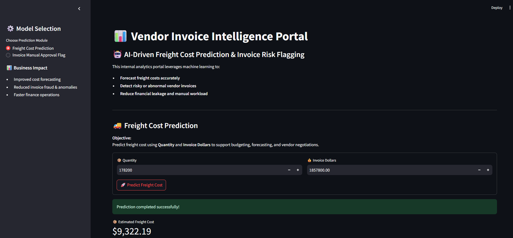
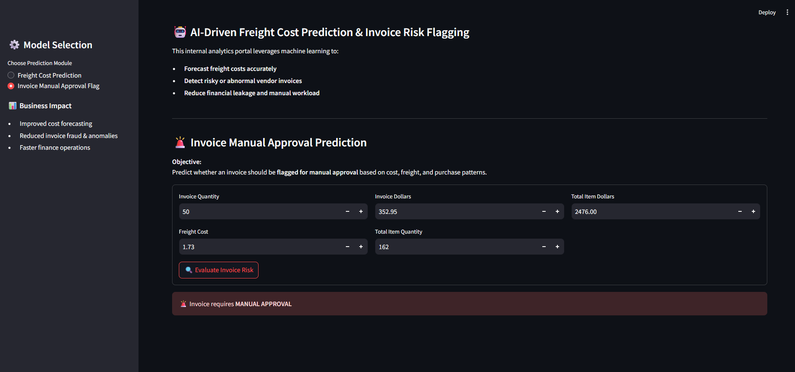

# 📊 Vendor Invoice Intelligence System

### 🚀 AI-Driven Freight Cost Prediction & Invoice Risk Flagging

This project implements an **end-to-end machine learning system** designed to help finance teams:

* Predict freight costs accurately
* Detect risky or abnormal vendor invoices
* Reduce financial leakage and manual workload

---

## 📌 Project Overview


This system solves two key business problems:

1. **Freight Cost Prediction (Regression)**
2. **Invoice Risk Flagging (Classification)**

It combines:

* SQL-based feature engineering
* Machine learning models
* A Streamlit-based interactive dashboard

---

## 🎯 Business Objectives

### 1️⃣ Freight Cost Prediction

**Objective:**
Predict expected freight cost using quantity, invoice value, and historical patterns.

**Why it matters:**

* Freight is a major component of landed cost
* Poor estimation impacts budgeting and margins
* Early prediction improves vendor negotiation

---

### 2️⃣ Invoice Risk Flagging

**Objective:**
Identify invoices that should be flagged for manual review based on abnormal patterns.

**Why it matters:**

* Manual review doesn’t scale
* Financial leakage occurs in complex invoices
* Early detection improves operational efficiency

---

## 📂 Data Sources

Data is stored in a **SQLite database (`inventory.db`)** with:

* `vendor_invoice` → Invoice-level financial & timing data
* `purchases` → Item-level purchase details
* `purchase_prices` → Reference pricing
* `inventory snapshots` → Stock data

📌 SQL aggregation is used to generate **invoice-level features**

---

## 📊 Exploratory Data Analysis (EDA)

Key questions explored:

* Do flagged invoices have higher financial exposure?
* Does freight scale with quantity?
* Are delays linked to anomalies?

Statistical tests (**t-tests**) were used to validate feature significance.

---

## 🤖 Models Used

### 🔹 Regression (Freight Prediction)

* Linear Regression (baseline)
* Decision Tree Regressor
* Random Forest Regressor ✅ *(final model)*

---

### 🔹 Classification (Invoice Flagging)

* Logistic Regression (baseline)
* Decision Tree Classifier
* Random Forest Classifier ✅ *(final tuned model)*

📌 Hyperparameter tuning done using **GridSearchCV with F1-score**

---

## 📈 Evaluation Metrics

### Freight Prediction

* MAE
* RMSE
* R² Score

### Invoice Flagging

* Accuracy
* Precision, Recall, F1-score
* Classification Report
* Confusion Matrix
* Feature Importance

---

## 🖥️ End-to-End Application

A **Streamlit dashboard** enables real-time predictions:

### Features:

* Input invoice details
* Predict freight cost instantly
* Flag risky invoices
* Provide human-readable insights

---

## 🧩 Project Structure

```
vendor-invoice-intelligence/
│
├── data/                      # (Not included due to size)
├── models/
│   ├── predict_freight_model.pkl
│   ├── predict_flag_invoice.pkl
│   └── scaler.pkl
│
├── data_preprocessing.py
├── modeling_evaluation.py
│
├── freight_cost_prediction/
├── invoice_flagging/
│
├── inference/
│   ├── predict_freight.py
│   └── predict_invoice_flag.py
│
├── app.py                    # Streamlit app
├── README.md
└── .gitignore
```

---

## ⚙️ How to Run This Project

### 1️⃣ Clone the repository

```bash
git clone https://github.com/abhianvSmeena/vendor-invoice-intelligence.git
cd vendor-invoice-intelligence
```

---

### 2️⃣ Install dependencies

```bash
pip install -r requirements.txt
```

---

### 3️⃣ Run the Streamlit app

```bash
streamlit run app.py
```

---

## ⚠️ Note on Data

The dataset (`inventory.db`) is **not included** due to size constraints.

You can:

* Connect your own SQLite database
* Or create sample data for testing

---

## 🧠 Key Learnings

* End-to-end ML system design
* Feature engineering using SQL
* Weak supervision (rule-based labeling)
* Handling class imbalance with F1 optimization
* Building ML-powered applications

---

## 📬 Author

**Abhinav Singh Meena**

---

## ⭐ If you like this project

Give it a ⭐ on GitHub — it helps a lot!
